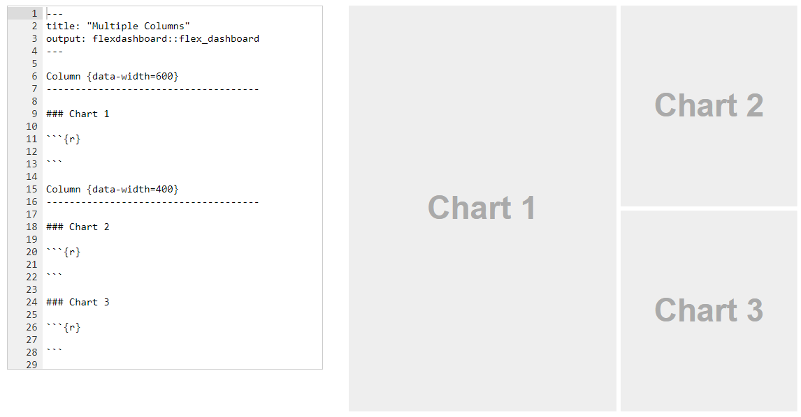
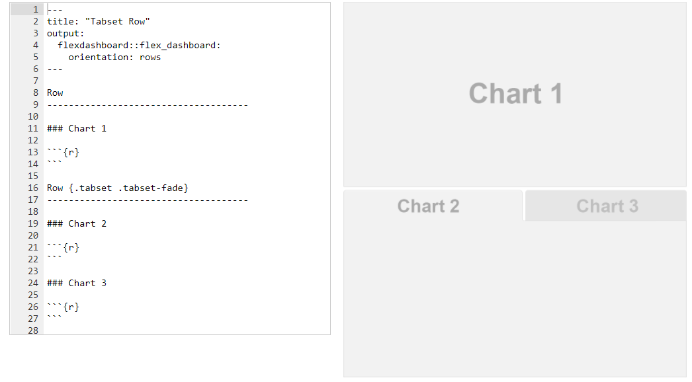

# 介绍

从CRAN安装flexdashboard软件包
```{r}
# install.packages("flexdashboard")
```

要编写flexdashboard，您可以使用输出格式创建R Markdown文档flexdashboard::flex_dashboard。您可以使用新的R Markdown对话框在RStudio中执行此操作：


如果不使用RStudio，则可以flexdashboard从R控制台创建一个新的R Markdown文件：

```{r eval=FALSE, include=TRUE}
rmarkdown::draft("dashboard.Rmd", template = "flex_dashboard", package = "flexdashboard")
```


## 仪表板基础

### 组件

您可以使用flexdashboard将相关数据可视化组发布为仪表板。Flexdashboard可以是静态的（标准网页），也可以是动态的（Shiny交互式文档）。flexdashboard布局中可以包含各种各样的组件，包括：

基于htmlwidgets的交互式JavaScript数据可视化。

R图形输出，包括基础，晶格和网格图形。

表格数据（具有可选的排序，过滤和分页）。

用于突出显示重要摘要数据的值框。

用于在指定范围内的仪表上显示值的仪表。

各种文本注释。

有关每种组件类型的使用的更多详细信息，请参见仪表板组件文档。


## 布局

### 方向

- 按列布局

仪表板分为列和行，并使用3级降价标题（###）描绘了输出组件。默认情况下，仪表板布置在单列中，图表垂直堆叠在列中，其大小可填充可用的浏览器高度。

默认情况下，仪表板中的2级降价标题（）定义列，各个图表垂直堆叠在每一列中。这是两列仪表板的定义，左侧有一个图表，右侧有两个图表：


两列，第二列包含两行



- 按行布局

通过指定`orientation:rows`选项，您还可以选择按行而不是按列定向仪表板。例如，此布局定义了两行，其中第一行有一个图表，第二行有两个图表：


- vertical_layout: scroll 将列的图片进行滚动

- 通过data-width属性为该列提供了更大的尺寸

- orientation: rows 以行填充为默认仪表盘形式

### 滚动布局

默认情况下，Flexdashboard图表的布局可以自动填充浏览器的高度。这对于少数垂直堆叠的图表效果很好，但是，如果您有很多图表，则可能需要滚动而不是全部放置在页面上。您可以使用vertical_layout选项控制此行为。指定fill垂直调整图表大小，以便它们完全填满页面，并scroll以自然高度布置图表，并在必要时滚动页面。


### 标签集

如果您要在行或列中显示多个组件，则可以尝试将它们作为选项卡布局，而不是尝试同时将它们全部显示在屏幕上。当一个组件是主要组件（即，所有读者都应该看到）而其他组件提供仅某些读者可能感兴趣的次要信息时，这尤其合适。

在许多情况下，选项卡集比vertical_layout: scroll显示大量组件更好，因为它们很容易导航。

要将行或列布置为选项卡集，只需将{.tabset}属性添加到节标题即可。例如，以下代码列出了tabset中的第二列：


行也可以作为选项卡布局，如下所示：

请注意，在此我们还应用了{.tabset-fade}在切换标签时导致淡入/淡出效果的属性。



注意，这里我们还应用了{.tabset-fade}选项卡时产生淡入/淡出效果。

## 组件

### HTML小部件

所述htmlwidgets框架提供为JavaScript数据可视化库高级的R绑定。基于htmlwidgets的图表非常适合与flexdashboard一起使用，因为它们可以动态调整自身大小，因此几乎总是完美地适合其flexdashboard容器的范围。

可用的htmlwidgets包括：

Leaflet，一个用于创建支持平移和缩放的动态地图的库，带有各种注释，例如标记，多边形和弹出窗口。

dygraphs，它提供了用于绘制时间序列数据的丰富功能，并支持许多交互式功能，包括序列/点突出显示，缩放和平移。

Plotly，通过ggplotly界面，可以轻松地将ggplot2图形转换为基于Web的交互式版本。

rbokeh是Bokeh的接口，Bokeh是用于创建基于Web的绘图的强大的声明性Bokeh框架。

Highcharter，是流行的Highcharts JavaScript图形库的丰富R接口。

visNetwork，是vis.js库的网络可视化功能的接口。

CRAN上有30多个提供htmlwidgets的软件包。您可以在htmlwidgets展示柜中找到一些较流行的htmlwidget的示例用法，并浏览图库中所有可用的widget 。

您在R Markdown文档中包含htmlwidget，就像您包含R图一样。例如，以下是一个简单的仪表板定义，其中包含3个笔形时间序列图：


